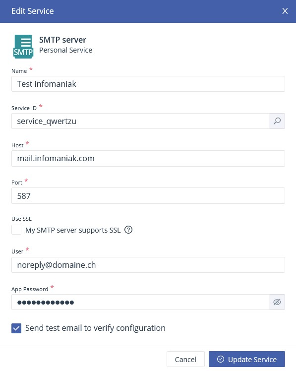
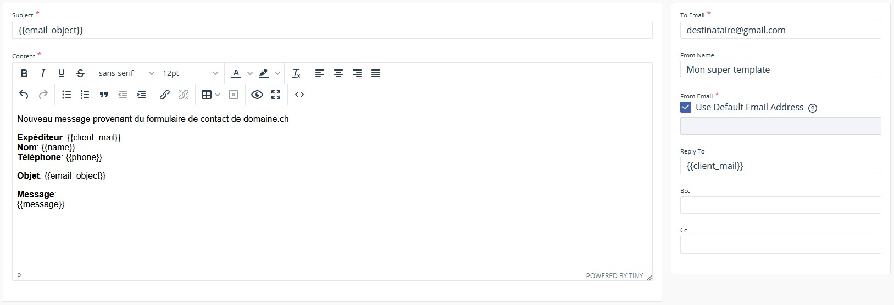

Les formulaires de contact sont devenus presque indispensables pour les sites de type vitrine. Je doute qu'ils soient toujours utiles et utilisés, mais malgré ça, tout le monde en veut un, et j'avoue que c'est quand même plus classe que de juste afficher une adresse mail. Mais c'est parfois le seul élément interactif du site, et donc un élément qui va demander plus de temps de développement. Et jusqu'à maintenant j'utilisais PHPMailer, et donc je devais m'embêter à héberger le site sur un serveur avec PHP uniquement pour ce foutu formulaire de contact. Et quand des services comme Netlify ou Surge.sh existent, je me dis que c'est quand même bien dommage de ne pas pouvoir les utiliser à cause d'une seule fonctionnalité.

Je me suis donc dit qu'il devait bien exister des services appelables en JavaScript, ou bien juste une bête API avec un PHPMailer derrière. Et bien j'ai trouvé l'outil [EmailJS](https://www.emailjs.com/) qui remplit exactement mes besoins. Ce n'est pas le seul outil existant, il y a également un autre [emailjs](https://github.com/eleith/emailjs) qui est opensource et qui ne nécessite pas de créer un compte sur une plateforme. Je suis très content d'EmailJS alors je n'ai pas testé son concurrent opensource, mais je le garde de côté au cas où j'atteindrais les limites de la version gratuite d'EmailJS.

## Comment ça marche?

C'est vraiment simple. Premièrement, vous vous créez un compte. Ensuite il va falloir paramétrer un "Email Service", c'est-à-dire un serveur d'envoi. Pour ma part, j'ai utilisé une adresse mail hébergée chez Infomaniak, donc j'ai utilisé leur serveur SMTP

<div style="max-width: 25rem; margin: auto">
    
</div>

Ensuite vous créez un template d'email en intégrant les champs de votre formulaire avec une syntaxe en {{ moustache }}



Finalement, vous intégrez ça à votre code. Par exemple:

```javascript
import { init } from 'emailjs-com';
import * as emailjs from 'emailjs-com';
init("user_votrePropreUserId");

const form = document.querySelector('form')

form.addEventListener('submit', evt => {
    evt.preventDefault()

    let name = form.querySelector('#name').value
    let client_mail = form.querySelector('#mail').value
    let phone = form.querySelector('#tel').value
    let email_object = form.querySelector('#object').value
    let message = form.querySelector('#message').value

    emailjs.send('service_qwertzu', 'template_qwertzu', { name, client_mail, phone, email_object, message })
        .then(function (response) {
        	console.log("Success")
        }, function (error) {
        	console.log("Erreur", error)
        });
})
```

Et voilà! D'autres fonctionnalités existent comme par exemple les réponses automatiques, l'enregistrement des contacts, l'ajout de pièces jointes et autres. Je vous laisse les tester si ça vous intéresse.