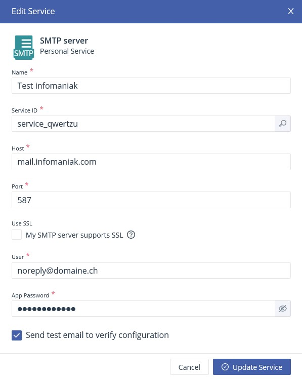
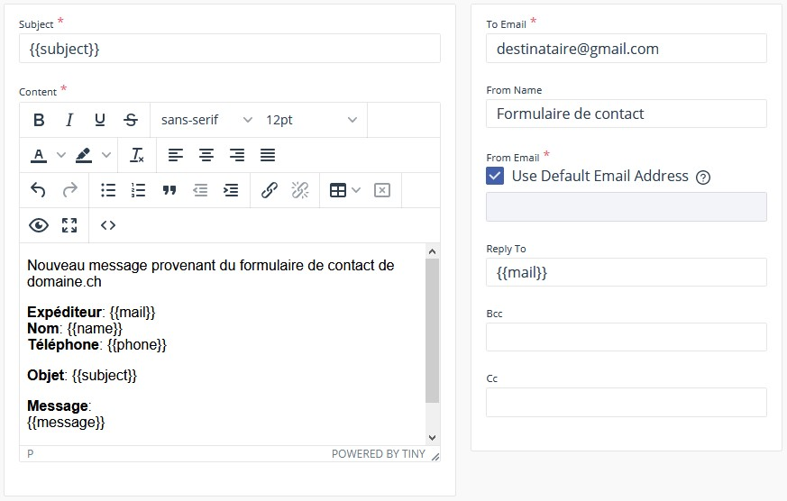
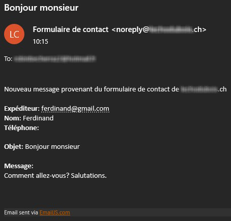
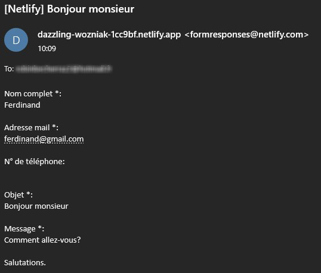

Les formulaires de contact sont devenus presque indispensables pour les sites de type vitrine. Je doute qu'ils soient toujours utiles et utilisés, mais malgré ça, tout le monde en veut un, et j'avoue que c'est quand même plus classe que de juste afficher une adresse mail. Mais c'est parfois le seul élément interactif du site, et donc un élément qui va demander plus de temps de développement. Jusqu'à maintenant j'utilisais PHPMailer, et donc je devais m'embêter à héberger le site sur un serveur avec PHP uniquement pour ce foutu formulaire de contact. Et quand des services comme Netlify ou Surge.sh existent, je me dis que c'est quand même bien dommage de ne pas pouvoir les utiliser à cause d'une seule fonctionnalité.

Je me suis donc dit qu'il devait bien exister des services appelables en JavaScript, ou bien juste une bête API avec un PHPMailer derrière. Et bien j'ai trouvé deux outils, [EmailJS](https://www.emailjs.com/) et [Netlify form handler](https://www.netlify.com/blog/2017/09/19/form-handling-with-the-jamstack-and-netlify) qui remplissent très bien mes besoins. J'ai testé les deux et je vais vous présenter en gros leur fonctionnement, leurs avantages et inconvénients.

## EmailJS

EmailJS est un outil développé spécifiquement pour envoyer des mails depuis JavaScript. Il nécessite de s'inscrire sur leur plateforme, de paramétrer l'outil, et ensuite vous pouvez intégrer ça sur n'importe quel site web. L'article [Send Email From Your React App with EmailJS](https://medium.com/javascript-in-plain-english/email-from-your-react-project-w-emailjs-d6af68fa5c17) explique très bien comment utiliser l'outil. Mais je vais quand même vous montrer ma configuration au cas où...

Pour le serveur d'envoi ("Email service" dans leur dashboard) j'ai utilisé une adresse mail hébérgée chez infomaniak

<div style="max-width: 25rem; margin: auto">
    
</div>

Ensuite j'ai créé le template d'email suivant en intégrant les champs de mon formulaire avec une syntaxe en {{ moustache }}



Finalement, j'ai intégré ça à mon code comme ça:

```javascript
import { init } from 'emailjs-com';
import * as emailjs from 'emailjs-com';
init("user_votrePropreUserId");

const form = document.querySelector('form')

form.addEventListener('submit', evt => {
    evt.preventDefault()

    emailjs.send('service_qwertzu', 'template_qwertzu', form)
        .then(function (response) {
        	console.log("Success")
        }, function (error) {
        	console.log("Erreur", error)
        });
})
```

Et voilà! D'autres fonctionnalités existent comme par exemple les réponses automatiques, l'enregistrement des contacts, l'ajout de pièces jointes et autres. Je vous laisse les tester si ça vous intéresse.

## Netlify form handler

Cet outil nécessite d'héberger son site sur Netlify. C'est peut-être éliminatoire pour certains, mais pour moi ça tombe bien puisque c'était justement mon but. L'article [Form Handling with the JAMstack and Netlify ](https://www.netlify.com/blog/2017/09/19/form-handling-with-the-jamstack-and-netlify/) explique bien le concept et la mise en place, mais de nouveau, je vais vous montrer ma config.

Déjà j'ai ajouté l'attribut `netlify` à ma balise `<form>`, ensuite, j'ai été obligé de changer le nom de mon champ "object" à "subject" pour qu'il soit bien reconnu par l'outil et que l'objet du mail reçu soit celui entré par l'utilisateur dans le formulaire. Ensuite du côté de l'outil j'ai pas grand-chose d'intéressant à vous montrer puisque la config se fait en deux clics, donc voici directement le code javascript pour intégrer tout ça:

```javascript
const form = document.querySelector('form')

form.addEventListener('submit', evt => {
    evt.preventDefault()

    let formData = new FormData(form)
    fetch('/', {
        method: 'POST',
        headers: { "Content-Type": "application/x-www-form-urlencoded" },
        body: new URLSearchParams(formData).toString()
    }).then(() => {
        	console.log("Success")
    }).catch((error) => {
        	console.log("Erreur", error)
    }) */
})
```

## Comparaison

Niveau code JavaScript c'est assez kiff kiff, à par peut-être qu'EmailJS nécessite d'ajouter un package et donc une dépendance.

Au niveau de l'email reçu, voici les résultats, en premier c'est EmailJS, ensuite Netlify

<div style = "display: flex; flex-wrap: wrap; justify-content: space-around;">
  <div style = "flex-basis: 25rem; margin-bottom : 1.5rem;">
      
  </div>
  <div style = "flex-basis: 25rem;">
      
  </div>
</div>

Une particularité de Netlify est que l'email provient de "formresponses@netlify.com" et on ne peut pas le changer. C'est d'un côté un avantage car on n'a pas à configurer un serveur d'envoi, mais si on veut envoyer des mails à un client ça peut paraitre moins professionnel. En général, l'inconvénient de Netlify est d'être peu personnalisable. EmailJS nous offre plus de libérté mais nous oblige à créer un compte sur leur plateforme.

Au niveau des limitations des versions gratuites, Netlify est limitée à 100 envois / mois / site. EmailJS est lui limité à 200 envois / mois / compte, à 50kb par envoi et à 2 templates / compte.