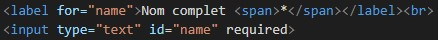
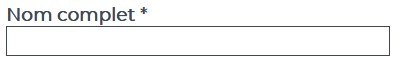

Je pense que la plupart des développeurs web sont aujourd'hui sensibilisés à l'accessibilité. C'est un sujet qui revient souvent dans les forums, on fait en général passer nos sites dans des analyseurs d'accessibilité, et c'est même une des 5 catégories de Google Lighthouse. La possibilité de naviguer dans un site à l'aide d'un lecteur d'écran est un des plus grands pans de l'accessibilité. Et pourtant, je me demande combien de développeurs ont déjà essayé de visiter un de leur site en utilisant un lecteur d'écran. L'article "[Building the most inaccessible site possible with a perfect Lighthouse score](https://www.matuzo.at/blog/building-the-most-inaccessible-site-possible-with-a-perfect-lighthouse-score/)" démontre que les outils d'analyse, en l'occurrence Lighthouse, ne sont absolument pas infaillibles. On sait tous (développeurs frontend) qu'il faut mettre des textes alternatifs aux images ou des labels à nos liens. Mais pour ma part en tout cas, j'avoue que je le faisais plus pour avoir un bon score SEO que par réél soucis d'accessibilité. Mais récemment, je suis tombé sur l'article "[How to use NVDA and Firefox to test your web pages for accessibility](https://www.marcozehe.de/how-to-use-nvda-and-firefox-to-test-your-web-pages-for-accessibility/)" de Marco Zehe, un ingénieur aveugle travaillant chez Mozilla. Cet article m'a donné envie de réellement me rendre compte de l'intérêt de toutes ces choses qu'on fait pour avoir un score de 100 sur Lighthouse.

J'ai donc installé le lecteur d'écran [NVDA](https://www.nvaccess.org/). Et autant vous dire que quand on n'a pas l'habitude on finit vite par désactiver le son, car tout ce que vous faites, même en dehors du navigateur, est commenté par un robot. Au passage, je vous conseille de choisir la voix de Guillaume dans les options. Sur du contenu anglophone c'est très drôle. J'ai ensuite visité un site que j'ai développé (on va l'appeler site.ch). Site.ch a un score Lighthouse de 97 en accessibilité donc en toute logique la navigation devrait être quasiment parfaite... spoiler... non 🙂

Il m'a fallu environ 3 secondes pour tomber sur une erreur basique. Mes liens Facebook et Instagram, représentés par des icônes, n'avaient pas de label. Ils étaient donc lus "link site.ch" au lieu de "link Facebook". Une erreur qui n'a pas été détectée par Lighthouse.

Ensuite je suis allé voir le formulaire de contact. Et honnêtement c'est un peu compliqué de juger si la navigation est correcte par rapport à un lecteur d'écran. Simplement car je ne sais pas comment une page est sensée être lue, quelle est la bonne pratique. Par exemple, mes champs de formulaire sont composés d'un label et d'un champ en dessous du label. 

Lorsque je survole le champ, le lecteur lit "edit required invalid entry has autocomplete". Donc on ne comprend absolument pas à quoi sert ce champ. Par contre si j'entre dans le champ, le lecteur lit "nom complet astérisque edit required invalid entry has autocomplete". Difficile de savoir si ce sont les informations attendues par un utilisateur de lecteur d'écran.

Je pourrais encore vous parler de beaucoup d'éléments dont la lecture me fait me questionner. Mais on se rend déjà compte qu'il y a un fossé entre la théorie et la pratique. Je ne dis pas qu'il faut tester tous vos sites avec un lecteur d'écran. Mais faire l'expérience au moins une fois permet de mieux évaluer l'accessibilité d'un code et d'être plus critique. Cette expérience a soulevé beaucoup de questions, et j'espère que je pourrais y apporter des réponses dans de futurs articles.